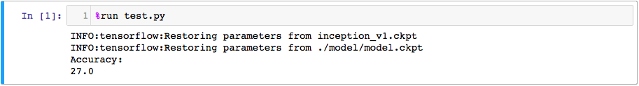

# Applying-Pre-trained-Model-on-Recognition
# Overview

Training deep neural networks can be a suffering task for its time cost and compution burden. What makes it worse is that there can be a lot of hyperparameters, which can be really hard to tune. In order to alleviate the burden of GSS(Graduate Student Search), we need a more stable model with less hyperparameters. In this repo, we offer a way of doing this by applying ImageNet pre-trained model in a specific model.

The toy dataset used in this repo can be downloaded on https://skydrive.live.com/?cid=1E04F731C1DD71BC&id=1E04F731C1DD71BC!112#cid=1E04F731C1DD71BC&id=1E04F731C1DD71BC!113. Thank the scientists from Microsoft Research for offering the data. More information is available on https://www.microsoft.com/en-us/research/project/msra-cfw-data-set-of-celebrity-faces-on-the-web/. You can download the toy dataset and extract it in the root dictionary, then run the preprocess.py script to get the toy data for training and testing.

The model used in this model contains a pre-trained inception-v1 network and two fully connected layers, which are 256d and 10d, respectively. The checkpoint file is downloaded from http://download.tensorflow.org/models/inception_v1_2016_08_28.tar.gz. Refer to https://github.com/cameronfabbri/Compute-Features if you need more models.

# Requirements

tensorflow

numpy

cv2

# Structure


# Usage

Train a model and save it in /model dictionary:

```
python inception_v1_trianing.py
```


Use Tensorboard to monitor the training:

```
tensorboard --logdir=train --port 6006
```


Test the performance of our model:

```
python test.py
```



# Summary

Adam optimizer and softmax_cross_entropy_with_logits loss are used in this repo, which are wildly used optimizer and loss. There're 200 frames for training and 200 for testing, which is toooooo small for a deep learning model. Actually the model suffer from serious overfitting when testing. Add Siameae loss usually help handling this condition. But I don't want to spend too much time tuning and optimizing a toy, and adding to much techniques may make the code much more hard to understand. In addition, the test dictionary contains the same identities with the training set and I don't think that the test make sense even if I set the test dictionary as test, so the accuracy shown above is implemented on training set. But I think it's OK to implement a weak test because this is just a demo to show the usage of pre-trianed model. If you're new to deep learning and havn't got powerful machine, this repo can be a good tutorial for you to start a computer vision project.